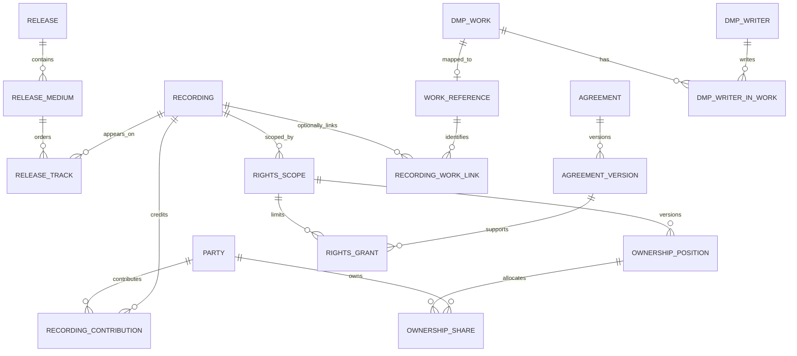

# P7 Archive & Rights / P7 Arkiv og rettigheter

Date: 12 September 2026
Status: architectural baseline; phase 2 operational catalogue implemented
Audience: P7 product owners, developers and future data-migration partners

## 1. Recommendation and scope

Build a modular archive and rights application around the proven parts of the existing `music_publisher` app. DMP is the historical foundation and remains responsible for publishing works, writers, manuscript shares, CWR and acknowledgements. P7's canonical architecture and data integrity take priority over future upstream merge simplicity. Add an independent recording catalogue and master-rights domain, connected through an optional integration app. Start with one PostgreSQL database and one deployment; separate services would add unnecessary synchronization and operational complexity at this stage.

A recording must be creatable with a UUID and its own title, without a Work, ISRC, release, owner or publishing registration. Incomplete metadata and unverified rights must be visible states, not fabricated placeholder works or assumed ownership. Later, a user can create a Work and writers in DMP before any recording exists. Neither workflow depends on completing the other.

Use standard industry entities in the canonical schema. P7 is an organization and an operator configuration, not a table prefix, default owner, territory assumption or special right type. The master catalogue is authoritative for new recording metadata; DMP remains authoritative for publishing data. Exchange formats are adapters, not the database schema.

This assessment does not implement accounting, royalty settlement, automatic rights clearance, DDEX delivery, user interfaces or the complete proposed schema. It establishes boundaries and a first vertical implementation milestone.

## 2. Inspected baseline and evidence

Cloned fork: `https://github.com/tfgdngfxgfb/django-music-publisher.git`
Original upstream, identified in README and package metadata: `https://github.com/matijakolaric-com/django-music-publisher.git`
Fork `master` and fetched `upstream/master`: `45e41c4272e557bb3576c2124a78c7f6a8725007`
Comparison at assessment time: **0 commits ahead, 0 behind; no tracked file differences**. An `upstream` remote was added locally. This comparison concerns these branches, not all branches or future upstream changes.

The assessment is based on source inspection, migration inspection and Git comparison. No production database, real catalogue, deployment or partner specification was supplied. The Django suite was not run; runtime compatibility is an explicit implementation gate, not a verified result.

Evidence below refers to the inspected commit; line numbers belong to that baseline:

| Area | Existing implementation | Architectural implication |
| --- | --- | --- |
| Application structure | `dmp_project/settings.py`, `dmp_project/urls.py`; `music_publisher/{models,base,admin,forms,api,views}.py` | Small, admin-led monolith. Domain behavior is spread across models, formsets, admin actions and import code, rather than isolated services. |
| Publishing | `models.py:577` Work, `:413` Writer, `:850` AlternateTitle, `:892` ArtistInWork, `:925` WriterInWork | Preserve the publishing graph and its existing identifiers. |
| Publishing validation | `forms.py:154` WriterInWorkFormSet | Normal editing requires a controlled writer, a composer and approximately 100% manuscript shares. These are publishing workflow rules; they must not gate recording intake. They are not universal database constraints. |
| Recordings | `models.py:1128` Recording; required `work` FK at `:1182`, `CASCADE` | One work per recording, with title fallbacks through Work. Merely making this FK nullable would leave dependent code and workflow assumptions. |
| Recording identity | `models.py`, Recording.recording_id | Generated identifier uses publisher code and integer row ID, not the Work ID. Titles and serialization depend on Work, while identifiers depend on publisher configuration until persisted. Neither is a suitable portable canonical identity. |
| Releases | `models.py:142` Release, `:1349` Track; `base.py:392` ReleaseBase | Existing track through-table is useful in publishing, but has one cut number and no disc hierarchy. EAN validation requires 13 digits. Release has one display artist and label. |
| Release categories | LibraryRelease, CommercialRelease and Playlist proxy managers | Meaning is inferred from null combinations of `library` and `cd_identifier`; no independent canonical catalogue or release classification. |
| Shares and agreements | `base.py:212`; `models.py:925`, `:1465` | General/specific SAAN, control flags and publishing fee fields exist. There is no concrete general Agreement/chain-of-title model despite an old Writer docstring referencing one. Publishing fractions derive from settings and writer shares. |
| Territory | `models.py:44` WORLD_DICT, Work/Writer dictionaries and CWR generators | Publishing output uses worldwide territory assumptions. No recording-rights territory/time ledger. |
| CWR | `models.py:1413` CWRExport; `cwr_templates.py`, `templatetags/cwr_generators.py`; `models.py:2066` WorkAcknowledgement | Existing implementation includes paths for CWR 2.1, 2.2, 3.0 and 3.1, plus stored exports and ACK imports. Preserve behavior; code support is not proof of acceptance by a particular society. |
| Import/export | `data_import.py:36` DataImporter; `admin.py`; `api.py` BackupViewSet | Work-oriented CSV intake includes nested recording metadata. Backup JSON is a work/release view, not a complete portable database backup or master-rights interchange format. |
| API | `api.py`, `urls.py` | Read-only artist/release views, secret playlists and a superuser metadata export; no general master-rights CRUD API. |
| History | Work.last_change; admin save hooks; DataImporter.log; DataImport/ACKImport | Useful operational history, but not complete immutable field-level provenance. Import logging depends on a supplied user. Direct writes can bypass admin hooks. |
| Royalties | `royalty_calculation.py` | Publishing calculation follows WriterInWork shares and publisher terms. It is not a master ownership, performer remuneration or settlement engine. |
| Tests and migrations | `music_publisher/tests/tests.py`, `music_publisher/migrations`, `.github/workflows/build.yml` | Existing validation, admin, model, CWR and import tests are valuable regression assets. Migration history includes replacement/squashed migrations and must be preserved. |

### Deployment findings to resolve before implementation

`requirements.txt` requests Django `>=5.2,<5.3`, whereas `setup.py` requests `>=4.2.13,<5.0` and identifies package version `24.12.1`; project settings identify `26.4 HOLIDAY SPECIAL`. Thus installing as a packaged dependency and running the checkout are not equivalent supported configurations. Start from the checked-out application, select and lock a tested Django 5.2/Python/PostgreSQL combination, and resolve packaging separately. Django's published support schedule records the end of 4.2 extended support in April 2026, so downgrading to satisfy old packaging metadata is not the proposed production path. [Django support schedule](https://www.djangoproject.com/download/).

The settings also contain older storage configuration (`DEFAULT_FILE_STORAGE`), environment values without consistent boolean parsing and permissive host defaults. Validate these in the new host configuration and test actual file storage with the selected Django version. Do not infer deployment readiness from source or CI configuration alone. CI declares PostgreSQL versions in its matrix but uses an unversioned service image; pin the actual database image in the new integration tests.

## 3. Reuse and conflicts

### Reuse unchanged within the publishing boundary

- Work, Writer, WriterInWork, AlternateTitle, ArtistInWork and their publishing forms/admin.
- DMP Recording, Release, Track, Artist, Label, Library and proxy models for existing publishing records and CWR metadata. Do not promote these tables into the new canonical master domain.
- CWR generators/templates, stored exports, ACK ingestion, work acknowledgements and existing publishing identifiers.
- Publishing CSV import, JSON export and royalty calculations for their current purpose.
- Existing migrations, tests, validators and MIT notices. Keep CWR validation at the publishing/export boundary; new international metadata must not inherit its name/title restrictions.
- Django authentication, groups, permissions, admin infrastructure and storage abstractions, with separate permissions for contracts and rights administration.

### Conflicts and decisions

| Conflict | Decision |
| --- | --- |
| Recording must reference exactly one work | New `catalogue.Recording`, with zero-to-many work links in `publishing_bridge`. No dummy Work records. |
| Work deletion cascades to DMP Recording | Bridge protects linked DMP works. Canonical recording deletion is independent of DMP and normally replaced by retirement. |
| One recording artist; Artist and Writer use separate person-shaped records | New Party identity with Person/Organization/Group subtypes, artist identities and role-bearing contributions. Map to existing DMP records explicitly. |
| Publishing manuscript shares and fees | Separate ownership, revenue participation, licences and collection mandates. Never translate manuscript share into a master split. |
| SAAN/control flags are not master contracts | New versioned agreements, parties, scoped interests and evidence links. |
| World/publisher settings | Territory memberships and dated interests in data; operator and publisher configuration stay outside canonical ownership. |
| Integer and publisher-derived IDs | UUIDs for all new entities and relationships; preserve DMP IDs via bridge mappings and exports. No DMP PK conversion. |
| EAN-only and CWR-shaped names | Scheme-aware external identifiers and multilingual Unicode metadata with partner-specific export validation. |
| Label/library resembles owner/catalogue | Model labels, catalogue membership and rights holders separately. A label credit is not evidence of title. |
| Admin logs and snapshots | Transactional audit events and immutable source assertions covering API, admin, import and background jobs. |

Extending DMP Recording through multi-table inheritance, proxy models, monkey patches or parallel nullable fields would retain its required Work dependency and make upstream upgrades fragile. A new independent aggregate is justified despite some duplicate descriptive concepts.

## 4. Proposed Django structure and dependencies

Initially keep code in this repository; do not split services or publish a replacement DMP package.

```text
rights_project/          New host settings, URLs, operator branding and deployment
music_publisher/         Historical DMP publishing foundation; focused P7 changes allowed
rights_core/             UUID conventions, Entity registry, reference vocabularies
parties/                 Parties, names, artist identities, relationships
catalogue/               Recordings, releases, tracks, labels, identifiers, duplicates
music_library/           Musikkarkiv membership and radio metadata
managed_music/           Explicit managed-music membership
provenance/              Sources, source records, field assertions and decisions
media_assets/            Portable file identity and current/historical locations
rights/                  Scopes, agreements, ownership, grants, revenue splits
neighbouring_rights/     Representation mandates, claims, submissions, responses
distribution/           Delivery metadata, release availability, delivery history
data_exchange/          Source assertions, identifiers, staged imports and exports
audit/                  Append-only changes and request/job correlation
publishing_bridge/      Only new app importing DMP models; work and identity links
```

These are bounded modules, not a requirement to create every app in milestone one. Core, parties, catalogue, rights and bridge form the initial domain; audit and exchange supply shared infrastructure. Delay neighbouring-rights and distribution tables until their first workflow, using the interfaces described here.

Implemented dependency direction: parties → core; catalogue → parties/core; music_library → catalogue/core; provenance → core with portable typed UUID targets; managed_music → music_library/catalogue/provenance; media_assets → catalogue/core. Future rights, neighbouring-rights, distribution and bridge apps remain deferred. Use explicit migrations, FK relationships and transaction-protected application services; avoid cross-app side effects in model signals.

The new host configures DMP's required settings explicitly and mounts routes without name collisions. Preserve existing DMP URL names and path behavior where possible, introduce `/rights/` and `/api/rights/v1/`, and test reverse resolution and permission boundaries. Do not enable public or secret playlist surfaces for canonical assets or contract files by inheritance.

## 5. Canonical entity relationship model

### Identity and shared conventions

New entity and relationship IDs are immutable UUIDv4 values generated before persistence. Business IDs never serve as primary keys. Use `created_at`, `updated_at`, integer `revision` for optimistic locking and retirement state where appropriate; rights facts carry separate valid-time and recorded-time history.

Use a small `Entity(id UUID PK, entity_type)` registry for identifiers, provenance and audit. Domain entities have explicit one-to-one `entity_id` as their UUID primary key, created atomically; enforce type correspondence in services and database triggers where needed. This registry holds identity only, not arbitrary business attributes. Business relationships always use concrete FKs, never Django GenericForeignKey or unvalidated `(type, object_id)` pairs. Relationship rows that need identifiers or provenance also receive an Entity record. Code-list rows may use published codes as keys.

### Catalogue and parties

| Entity | Key relationships and fields |
| --- | --- |
| Party | `kind` = person, organization or group; exactly one matching Person/Organization/Group extension. No automatic equivalence between group, artist identity and legal organization. |
| PartyName | Party FK, name type, full display text, language/script, optional validity dates. Legal names and aliases coexist. Person may also have structured name components. |
| PartyRelationship | From/to Party, controlled relationship type, validity dates; e.g. group membership. Does not imply rights ownership. |
| ArtistIdentity | Party FK, stage/display name, status; one Party can have several public identities. Performer credits may exist without an ArtistIdentity. |
| Recording | Own title, version designation, recording kind, duration in integer milliseconds, language, metadata status; no Work FK, no mandatory ISRC, release or ownership. One row is the identified recording, not a particular WAV encoding. |
| RecordingTitle | Recording FK, title type, language/script; preserves alternative and localized titles. |
| RecordingRelationship | Parent/child Recording FKs, type such as edit, remix, remaster or derived-from; not automatic identity merging. |
| RecordingContribution | Recording, Party, role, optional ArtistIdentity, credited-as text, display order, optional instrument and session. Role and instrument use versioned vocabularies; a producer credit does not establish master ownership. |
| Asset | Recording FK for audio renditions, immutable storage key, checksum/algorithm, media type, format, sample rate, bit depth, channels, size. Asset revision or re-encoding does not automatically create a new Recording/ISRC. |
| Label | Label/imprint identity and names. LabelPartyRelationship records the operating organization and dates; a brand is not necessarily a legal person. |
| Catalogue | Named managed collection; CatalogueRecording and CatalogueRelease membership tables. Membership neither transfers nor establishes ownership. Catalogue-party roles record administration separately. |
| Release | Identifiable edition/product, title, type, format, metadata status; identifiers external. Related editions use ReleaseRelationship. |
| ReleaseMedium | Release FK, medium/disc position and format; unique `(release, position)`. |
| ReleaseTrack | Medium FK, Recording FK, track position, optional display title; unique `(medium, position)`. Same recording can occur on multiple releases or twice on one release. |
| ReleaseArtist / ReleaseLabel | Explicit role/order joins to ArtistIdentity and Label. Display text may be retained alongside structured participants. |
| ReleaseTitle / ReleaseDate | Localized titles; typed release dates with territory scope and date precision. Unknown dates remain unknown, not January 1 placeholders. |
| RecordingNotice / ReleaseNotice | Typed P-line/C-line, year, credited Party when known, exact notice text and evidence. Copyright notice is descriptive evidence, not verified ownership. |

ISRC identifies a recording rather than its work, performer or release; file format alone does not define a new identity. Keep assignment/reassignment decisions explicit and reviewed against the applicable ISRC rules. [IFPI ISRC](https://isrc.ifpi.org/), [IFPI FAQ](https://isrc.ifpi.org/faqs).

### External identifiers and standards

`IdentifierScheme(code, authority, version, subject_types, normalization_rule)` and `ExternalIdentifier(entity, scheme, namespace, raw_value, normalized_value, status, valid_from, valid_to)` support ISRC, GTIN/UPC/EAN, ISNI, IPI, ISWC, DPID, society repertoire IDs and distributor/platform IDs. Namespace includes issuer/account scope where identifiers are not global. Identifier assertions reference source evidence; rejected, disputed and superseded values remain discoverable.

Accepted active ISRC assignments are unique by normalized value across canonical recordings. Missing ISRC is absence of a row. Conflicting imported ISRCs enter staging, not a forced merge. Preserve raw presentation and normalize valid ISRCs to 12-character uppercase values. Scheme validation is separate from identity verification.

Represent UPC-A/GTIN-12 and EAN-13/GTIN-13 as strings with leading zeros retained. A canonical GTIN comparison key can be zero-padded to 14 digits while retaining original form; prevent equivalent UPC/EAN forms creating duplicate accepted product assignments. Never cast barcodes to integers. [GS1 guidance on communicating GTINs](https://www.gs1.org/edi-xml/technical-user-guide/Item_Numbers).

Use ISO 3166 country codes and versioned historical mappings, ISO 4217 currency codes, ISO 8601 dates/UTC timestamps and BCP 47 language tags. Territory group names and partner codes map explicitly to canonical territory memberships; neither names nor current membership should silently rewrite historic rights. Retain vocabulary version and unmapped source codes in staging.

### Rights, agreements and chain of title

| Entity | Key relationships and semantics |
| --- | --- |
| Territory / TerritorySet / TerritorySetMember | Versioned territory definitions. Sets materialize country memberships and retain the original expression, including worldwide/include/exclude intent. Unknown territory is distinct from worldwide. |
| RightType / UseType | Controlled, versioned concepts, with external mappings. Distinguish master title, reproduction/distribution permissions and neighbouring-rights collection bases. Jurisdiction-specific classifications remain explicit. |
| RightsScope | Recording FK, right type, optional use restriction, immutable TerritorySet version, start-inclusive/end-exclusive dates. Separate scope-completeness state; unknown dates are not treated as an unrestricted grant. |
| Agreement | Agreement type and lifecycle status; stable identity across amendments. |
| AgreementVersion | Agreement FK, sequence, execution/effective dates, document checksum/storage reference, supersedes version. Immutable executed evidence. |
| AgreementParty | AgreementVersion FK, Party FK, role such as assignor, assignee, licensor, licensee or administrator. |
| AgreementRecording | AgreementVersion FK, Recording FK, inclusion basis. Catalogue-wide schedules must resolve to a dated list; later membership changes do not silently enlarge a contract. Future-acquired coverage requires an explicit clause and reviewed additions. |
| OwnershipPosition | Scope FK, version/status, completeness, effective and recorded history. Represents one reconciled ownership schedule. |
| OwnershipShare | Position FK, owner Party FK, exact fraction numerator/denominator; unique owner per position. Supporting agreement/evidence via explicit joins. No default owner. |
| RightsGrant | Scope FK, granting/receiving Party FKs, AgreementVersion FK, grant kind, exclusivity, status; represents assignment, licence or administration authority. Assignments drive reviewed ownership changes, not just a licence flag. |
| GrantDerivation | Parent grant or predecessor ownership-share basis linked to child grant, attributable fraction and evidence. Acyclic chain can involve multiple predecessors. Validate parent authority and scope coverage. |
| RevenueSplitSet / RevenueSplit | Scope and AgreementVersion, revenue basis, currency where relevant, beneficiaries and exact fractions. Separate from legal ownership and publisher manuscript shares. No accounting engine implied. |
| RightsEvidence / RightsIssue | Explicit joins to source assertions and agreement versions; issue category, disputed facts, review decision and resolution. Conflicting claims are preserved apart from accepted positions. |

Do not make a single generic percentage mean ownership, collection authority and net revenue participation. Store exact reduced integer fractions (`0 <= numerator <= denominator`, `denominator > 0`) using suitably bounded integer fields and exact rational arithmetic; export numerator/denominator plus a profile-rounded decimal string where required. Never use binary floats. Unknown share has an explicit unknown state, not zero. Positive accepted ownership entries must exceed zero.

Accepted ownership totals are calculated per recording/right/territory/date slice. A **complete** position totals exactly 1; a **partial** position may total less than 1 with the missing fraction visibly unresolved. Totals above 1 remain disputed claims and cannot become an accepted position. Different revenue bases and neighbouring-rights entitlement classes must never be added into this total.

Dates use `[start, end)` intervals, with a documented adapter conversion for inclusive contract end dates. A null endpoint means unbounded only when explicitly marked as known-open; unknown term blocks automated authorization. Corrections create a superseding version with a recorded timestamp, allowing both “effective on date D” and “what did we believe at time T?” queries. Do not overwrite a historical owner on transfer.

Enforce simple checks and FK integrity in PostgreSQL. Before activating a rights schedule, lock the Recording row in a transaction, partition overlapping date/territory scopes, and check share totals, contradictory exclusivity and predecessor coverage across the partitions. All writers use this service; database triggers or deferred validation protect activation if direct SQL writes are supported. `model.clean()` alone cannot enforce concurrent aggregate rules. Published versions are immutable; activation and supersession are atomic.

Chain of title is an evidence graph, not an assertion that an uploaded contract proves ownership. An accepted grant cannot exceed its predecessor's territory, term, right or fractional authority. Partial documentary chains remain marked unresolved. Transfers preserve prior holdings; cycles, missing antecedents and inconsistent dates are review issues.

### Neighbouring rights and distribution

`RepresentationMandate` links represented Party, administrator/CMO Party, repertoire scope, territory/term, entitlement class and AgreementVersion. Recording- and contribution-level joins support rightsholder and performer administration separately. `SocietyMembership` stores scoped account/affiliation data; external account identifiers retain issuer namespace. `NeighbouringClaim` records recording, claimant, mandate, jurisdiction, entitlement basis, evidence and claim status. `ClaimContribution` connects performers and roles where relevant. `Submission`, `SubmissionItem` and immutable `Response` retain recipient, schema/profile version, payload checksum, external reference and acknowledgement history. Acceptance is not inferred from transmission, and producer/performer allocations are not inferred from ownership percentages.

Distribution uses `DeliveryProfile`, `ReleaseAvailability`, `AvailabilityGrant`, `DeliveryBatch`, `DeliveryItem` and `DeliveryResponse`. Availability specifies release/resource coverage, DSP/distributor Party, territory, time, use and commercial model, with explicit references to authority grants. Maintain original release date, territory-specific street date, takedown state, language, explicit-content status (including unknown), ordered credits, notices and asset technical metadata. Export metadata snapshots identify precisely what each recipient received. A delivered release or ISRC does not imply clearance.

DDEX ERN is a future adapter for release/resource delivery and availability terms; RDR-N is a future adapter for recording data and rights notifications. These are different workflows. Select an actual version, profile and recipient requirements before building either adapter, including applicable implementation-licence requirements. No DDEX compliance is claimed for this proposal. [DDEX ERN overview](https://kb.ddex.net/implementing-each-standard/electronic-release-notification-message-suite-%28ern%29/), [DDEX RDR-N](https://kb.ddex.net/implementing-each-standard/recording-data-and-rights-standards-%28rdr%29/recording-data-and-rights-notification-%28rdr-n%29/), [DDEX implementation introduction](https://ern.ddex.net/electronic-release-notification-message-suite-part-1-definitions-of-messages/1-introduction/).

### Work bridge and both workflows

`WorkReference(entity UUID, dmp_work OneToOne PROTECT)` supplies a stable portable identity for an existing DMP Work without altering its integer PK or CWR ID. It is an identity envelope, not another editable Work. `RecordingWorkLink(recording FK PROTECT, work_reference FK PROTECT, relationship_type, verification_status, evidence, sequence, start_ms, end_ms)` allows **zero to many links on either side**. Segment bounds are optional and validated against known duration. Medleys and sampled works use appropriate link types; segment durations do not establish publishing shares.

Unmatched imported work names/ISWCs remain source assertions or match candidates. Creating a WorkReference requires a real DMP Work; a master without known works simply has no confirmed links. Linking to a Work does not require an ISWC or successful CWR registration. Candidate matches never automatically trigger work registration.

`DmpWriterMap`, `DmpArtistMap`, `DmpLabelMap`, `DmpReleaseMap` and `DmpRecordingMap` are explicit crosswalks owned by the bridge. Use typed FKs and source-instance scope for external migrations; maps carry sync policy, last synchronized revision and verification state. Multiple reviewed legacy identities can converge on one canonical identity without rewriting historical IDs. Artist/writer name similarity is insufficient to merge people.

Initially bridge links are read-only toward DMP. In the later publishing milestone, materialize an optional DMP Recording projection only for a confirmed single-work mapping requiring recording information in CWR. DMP's unique ISRC and single Work FK make multi-work projection lossy: do not duplicate the same ISRC across several DMP recordings, invent codes or silently choose one work. Block that projection and require an explicitly supported publishing export policy. Ordinary DMP work registration can continue without projecting recording metadata.

New canonical recording fields are edited in the master catalogue; DMP work/writer fields in DMP. Existing DMP recordings are adopted through reviewed crosswalks and snapshots before any synchronization. A later bridge uses per-field source ownership, revision/hash comparisons and a conflict queue. No automatic bidirectional last-write-wins sync. Bridge writes must also reproduce required DMP validation and `last_change` behavior because saving models does not execute admin hooks.



Diagram shows the main relationships, not every evidence, vocabulary or temporal table.

## 6. Provenance, audit and exchange

`SourceSystem` identifies a supplier and source namespace; `ImportBatch` records file checksum, schema/mapping version, actor and receipt time. `SourceRecord` preserves immutable raw payload and row/record locator. `MetadataAssertion` links an Entity and structured field path to raw/normalized values, source record, observed time, confidence and assertion status. Manual entry is also a source. `AssertionDecision` records which assertion became canonical, who decided and why. One assertion can support several facts through explicit joins; conflicting values survive reconciliation.

Raw payloads and audit before/after snapshots may use JSON. Canonical rights, identities, relationships, dates and fractions remain typed relational data. Contract files and raw imports use protected storage, checksums and access control independent from public audio assets.

`AuditEvent` captures entity UUID, action, revision, UTC timestamp, actor/service identity, request/import correlation, reason and before/after values, including relationship changes. Write it in the same transaction as the domain mutation; do not rely only on admin LogEntry or signals. Restrict application updates/deletes to audit rows and retain backups. DMP history remains its native history initially; do not claim complete historical DMP audit coverage. A later publishing audit integration must cover every DMP write path or use database-level change capture with actor context.

Import pipeline: receive → retain source → parse → stage → validate → match → review conflicts → transactional apply → reconciliation report. An idempotency key includes source namespace, source record ID and source revision/checksum. Retry must not create another entity, identifier or accepted rights schedule. Missing source IDs require a documented stable file/row mapping and checksum policy. Fuzzy titles produce candidates, never silent merges; manual identity merges preserve redirect/crosswalk records and audit history.

Export a versioned neutral bundle: manifest, normalized entity tables (JSON Lines and/or CSV), relationship tables, UUIDs, external identifiers, code-list versions, exact fractions, validity intervals, assertion/evidence references, audit events and asset checksum manifests. Include DMP work/writer/share/acknowledgement data with bridge UUID crosswalks and original DMP IDs, plus native CWR artifacts where needed. A full recovery backup additionally includes the database and media; DMP's metadata endpoint is insufficient.

Schema/profile versions, explicit null semantics, decimal strings and ISO dates belong in the exchange contract. Test export → empty-database import → export for referential integrity and semantic equality, including unlinked masters and unknown/disputed rights. Enterprise adapters map this stable schema to recipient-specific fields and report every dropped/unmapped concept. Do not promise a lossless migration to an unspecified vendor: choose a target and run representative mapping/round-trip tests first. Portable relational facts and explicit crosswalks minimize the work without pretending all enterprise schemas agree.

## 7. Migration and DMP maintenance

### Repository and dependency strategy

1. Keep the recorded upstream commit as historical provenance. `origin` is P7's repository; `upstream` may remain as a reference, but compatibility and easy merging are not architecture goals.
2. Preserve the `music_publisher` app label, license notices, existing data and migration history. Make focused, tested changes when P7 data integrity, correctness or usability requires them; document material divergence.
3. Treat `dmp_project`, packaging and upstream CI as upstream-owned example/deployment assets. A new `rights_project` and separate tested requirements/CI own the combined deployment. Do not install the checkout and a PyPI copy of the same app simultaneously.
4. Add normal forward migrations without rewriting history. Preserve squash `replaces` histories; test fresh installs and representative previously migrated databases. Do not squash or fake migrations to simplify the graph.
5. Any future upstream code adoption is a selective port reviewed against P7's model, migration graph, CWR fixtures and complete test suite. It must not weaken canonical boundaries or overwrite P7-specific fixes.
6. Keep DMP fixes focused and covered by regression tests. Extracting DMP as an external package is optional and only appropriate if its runtime and interfaces later align with P7's needs.

### Existing-data migration

No source database was supplied; the initial implementation may be greenfield. If DMP data already exists, take a restorable database/media backup and retain all original PKs, identifiers, acknowledgements and CWR files. Create canonical entities in an additive import; never move or delete DMP rows during adoption.

For each legacy recording, allocate a persistent UUID crosswalk, capture its resolved title and raw title/suffix fields, assign identifiers after validation, preserve source provenance, create a WorkReference/link and map its releases/tracks/artist/label. Mark ownership unknown unless separate evidence is supplied. Neither label, writer control, publisher configuration nor a P-line proves master title. Resolve ambiguous identities manually. Do not infer rights from releases or catalogue membership.

Reconcile row counts, identifier duplicates, track order, relationship coverage, media checksums and unmapped metadata. Then make the canonical catalogue authoritative for adopted recording metadata through the bridge policy. Retain a migration report and source-ID map.

Deploy schema additively behind feature flags, backfill in resumable batches and rehearse on a restored copy. Rollback should first disable new routes/jobs while retaining new records; reversing migrations after users create rights data would lose work. For destructive future changes, use expand/backfill/verify/contract releases with separate backups and recovery tests. Enterprise cutover should use a stable snapshot, delta capture, reconciled crosswalks and an explicit authority switch to avoid competing writers.

## 8. First implementation milestone

**Deliverable: an independently usable recording register with evidenced partial ownership, reversible imports and optional DMP work links.** It proves the hardest boundary before building partner delivery or settlement.

### Included

1. Establish an isolated, locked runtime and a PostgreSQL test database. Run DMP's existing suite, migrations and CWR regression fixtures on the selected Django 5.2 runtime. Resolve baseline failures in separate reviewable changes before domain work.
2. Add the new host configuration and minimal core/party/catalogue models: UUID identity, parties, recording contributions, recordings, releases/media/tracks, labels/catalogue memberships and external identifiers. Admin entry starts from Recording and never asks for a Work.
3. Implement territory sets, a minimal agreement/version/evidence record, recording ownership positions and rational shares with explicit partial/complete/disputed states and dated versions. Require review before activation; do not calculate payouts or claim automatic clearance.
4. Add provenance and transactional audit for every new write path. Provide one documented staged CSV intake and a versioned neutral JSON export with stable UUIDs and source-ID crosswalks.
5. Add WorkReference and RecordingWorkLink with verified/candidate states, selecting real existing DMP works. Bridge reads DMP only in this milestone. Deleting a linked Work is protected; unlinking retains audit and the Recording.
6. Add dedicated permissions for metadata editing, ownership approval and contract access; keep contract files out of catalogue/media responses.

### Acceptance criteria

| Scenario | Required outcome |
| --- | --- |
| Enter a recording with title only | UUID allocated; zero DMP works/writers/recordings created; usable without ISRC or release. |
| Add ISRC later; retry same import | Same UUID; no duplicate identifier or recording; provenance includes both intake events. |
| Create a release with UPC and several tracks | Leading zeros preserved, ordered tracks resolve correctly; one recording can appear on another release. |
| Add 2/3 and 1/3 ownership in Norway for a known term | Complete schedule accepted with exact arithmetic; no writer/publisher shares are affected. |
| Add only 2/3 ownership | Partial schedule with unresolved remainder; no invented owner. |
| Concurrently activate conflicting ownership | Recording-level lock and validation prevent accepted total over 1; rejected attempt remains traceable. |
| Change ownership on a boundary date | Before/after date queries return correct owners; old recorded history remains reproducible. |
| Import conflicting ISRC or unknown territory | Quarantined/reviewable; no silent merge or worldwide right. |
| Link/unlink a Work; link two works | Master UUID and ownership unchanged; many-to-many links retained; no DMP projection created. |
| Start with a DMP Work and writers, then add a recording | Existing work-first editing/CWR behavior still passes baseline tests; recording link added later. |
| Export and reimport in a clean database | UUIDs, exact splits, track order, work crosswalks, source assertions and unknown states preserved. |
| View catalogue as metadata-only user | Contract documents and restricted audit payloads are inaccessible. |
| Fresh install and upgrade rehearsal | New migrations succeed, DMP schema unchanged, backup can be restored. |

### Deferred and decision points

Full grant derivation, complex contract schedules, revenue splits, performer mandates, society claims, DDEX/enterprise adapters, automated DMP projections, assets delivery and financial processing follow this milestone. Keep the proposed boundaries while adding them incrementally.

Before those follow-on workflows, obtain representative agreements, import files and intended recipient specifications. Confirm the relevant rights categories, contract end-date interpretation, repertoire scope and approval roles from those examples. Decide whether more than one publishing entity is needed: current DMP publisher settings describe one configured publisher, so multi-publisher publishing would need a separate assessment. Master ownership by many parties is already supported by this proposal and does not require that change.

## 9. Assessment completion

The repository was cloned and compared with original upstream; the existing model and workflow boundaries were inspected. This document is the only new tracked-content candidate. No application code, settings, dependency files or migrations were modified, and nothing was pushed to GitHub. The next step is implementing the bounded milestone above after reviewing this architecture.
